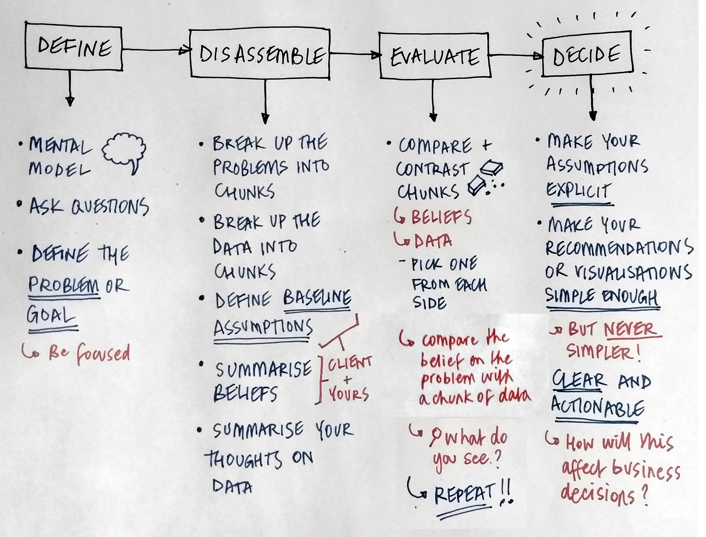

## Mental models

> Always make your <mark>mental modals as explicit as possible</mark>

Give your mental models the same <b>serious</b>, <b>careful</b> treatment as <b>data</b>.

### Question everything

Be careful of blindly following one perspective or mode of thought.

> You're attracted to what compels you [paraphrased]. <cite>(12 Rules for Life, Jordan Peterson, 2018)</cite>

In other words, <strong>what you focus on _matters_</strong>. The world will represent to you what you believe. Your mental model will reveal the features of the world you focus on.

----

For example: 🍸 Hipster place -vs- ☕ A regular place

I perceive a hipster place as <i>superficial</i> and <i>exclusive</i>.

----

<i>Meaning</i> is what draws you in. Focus is what has <i>meaning</i> for you.

### Your mental model

> Be concious of your <mark>clients mental model</mark>

- [x] Keep this in mind and you'll see what's important
- [x] To pick the right statistical model, you need be aware of your mental model
    - [ ] Your <b>statistical model</b> is <em>dependant</em> on your</em> on your <b>mental model</b>

> <b>If your mental model is wrong, your analysis or recommendations <strong>will fail</strong></b>

- [ ] How you ask questions, or posit theories <b>changes depending</b> on your <b>mental model</b>

----

