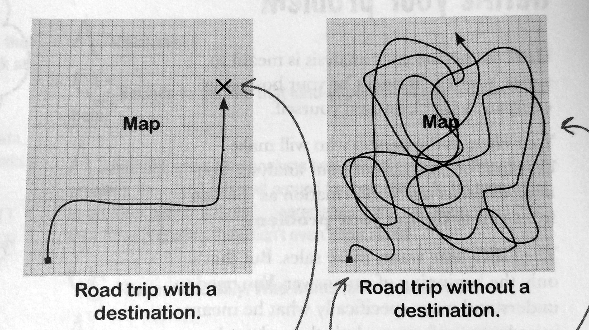

## Filling in the gaps

> <mark>Always include what you don't know</mark> as well as what you do

A mental model helps you <i>fill in the gaps</i> in your knowledge.

- [ ] Find problems and gaps in knowledge
- [ ] Test these with data wherever possible

You'll always need a mental model to fill in gaps of knowledge to understand the world — or make links between your data and knowledge.

- <strong>It's OK to be wrong</strong>
- Keep asking the question: <q>Does it work?</q>

> <mark><b>Todays</b> research</mark> become <b>assumptions</b> you take into <mark><b>tomorrows</b> research

- [ ] <strong>Make your assumptions explicit</strong>
    - so you can <b>recognise errors</b> and <b>change them</b>
- [ ] You can't test everything
    - but everything should be testable

## FOCUS

No matter how much data you have at your disposal, <strong><b>stay focused</b> on what you're trying to achieve!</strong>.

> BUILD → MEASURE → LEARN ⟲

----

----

## It's an ongoing process

Data analysis is an ongoing process. You can't know everything and todays success could be tomorrows failure.

1. <b>Add new data</b> when it becomes available
2. <b>Reassess your mental model</b> often:
    - Your mental model influences your data model
    - Your data model influences your mental model
- <b>Stay focused on your goals</b> and <b>make your assumptions explicit</b>

----

### Look it up! Further reading

1. [<b>Five hows</b> and <b>Five whys</b>](https://www.mindtools.com/pages/article/newTMC_5W.htm)
