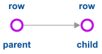
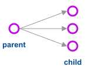
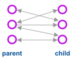

## Table relationships

| one-to-one                | one-to-many                | many-to-many                |
| ------------------------- | -------------------------- | --------------------------- |
|  |  |  |
| Exactly one row of a parent table is related to one row of a child table  | A parent record has many matching child records; a child table can only match _one_ parent record | Many of these records, match many of those |
| **e.g** social security number | **e.g** many people share the same profession | **e.g** many women own the same pair of shoes, many shoes are owned by the same women |

### Which data pattern to use?

#### One-to-one

You won't use _one to one_ data very often, as it generally makes sense to leave it in your primary table. It may make sense if:

1. You want to write faster queries; you only need the search data in the child table
2. You have an object with values you don't yet know. Splitting it out into a separate table avoids polluting your primary table with `NULL` values
3. Restrict data that's sensitive (you don't want other querying)
4. A large piece of data, splitting out can speed up queries

#### One-to-many

You'll use this regularly. Any data that is specifically linked to one entry in your main table:

1. Customer address
2. A profession
3. ...

#### Many-to-many

This can be useful for relating two-way relationships:

1. Books and their authors
2. Friendships
3. Ingredients and recipes
4. Customers and products

##### You'll probably need a junction ...

A junction table holds a key from each table. This way you can link a primary table and a child table, while avoiding duplicate entries.

- It helps stick to 1NF
- Helps with data integrity
- Avoids duplicates
- Change entries in _one_ place
